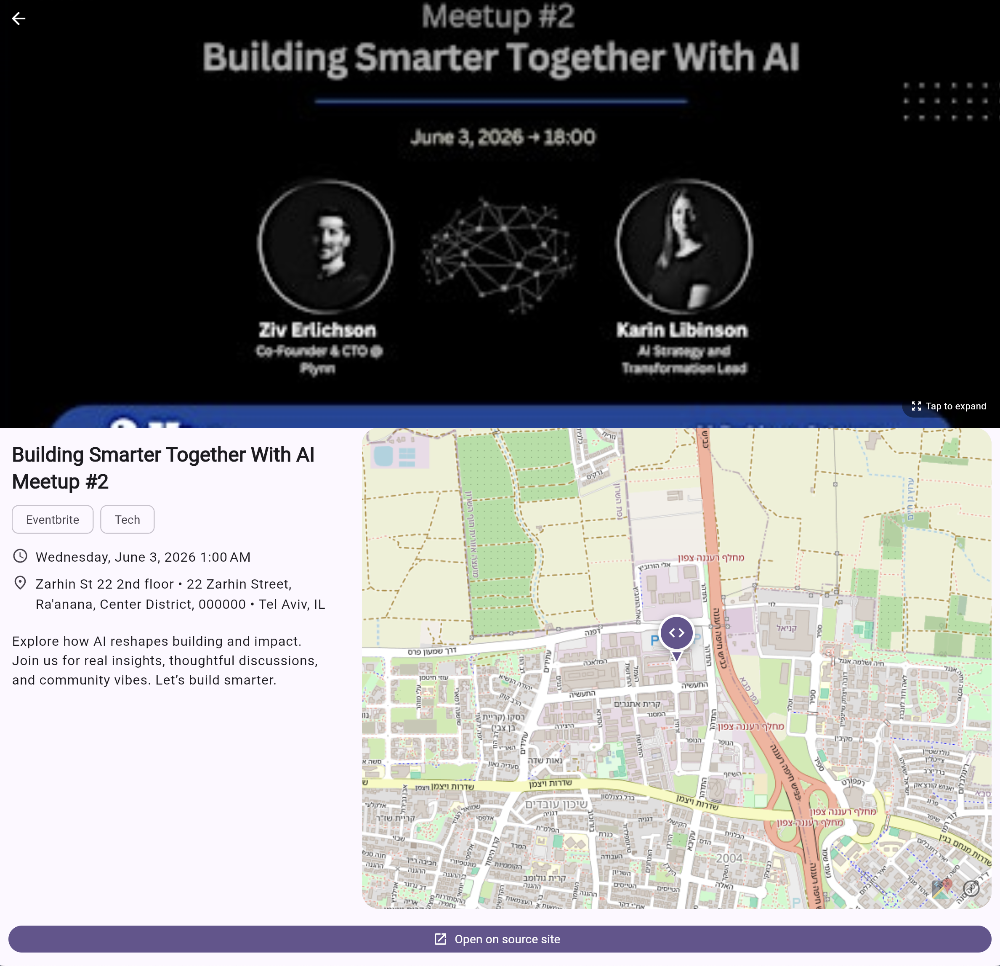

# Worldwide Events

+1500 Tech, Business, Music & Culture events — with group chat and live
location sharing between friends.

A multiplatform app built with Go and Flutter for browsing upcoming events
from across the world, pulled from license-free sources only.




- **`eventscraper_go/`** — Go backend. Scrapes Eventbrite, Songkick, Luma and
  viralagenda, caches everything in SQLite (or Postgres/PostGIS) with
  TTL-based stale-while-revalidate, exposes a JSON HTTP API, a WebSocket chat
  hub with ephemeral live-location sharing, an image proxy, and embedded ops
  dashboards. Full endpoint docs: [`eventscraper_go/README.md`](eventscraper_go/README.md).
- **`flutter_mobile_app/`** — Flutter client (iOS / Android / Web). Feed, map
  (MapLibre) and Groups tabs, filters, event detail, group chat with per-event
  public rooms + private invite-code groups, and live friend positions on the
  map.

## Services — how to access each one

Production base: **`https://api.iamjorgenunes.com/eventscraper`** (Docker on
Hetzner behind nginx; container binds `127.0.0.1:8090` on the host).

| Service | URL (production) | Auth | What it is |
|---|---|---|---|
| Events API | `…/events`, `…/events/{id}`, `…/cities`, `…/sources`, `…/geo/*`, `…/events.geojson` | none | Read API the app consumes. Filters: `city, category, source, from, to, q, limit, offset`. |
| Event submission | `POST …/events`, `POST …/upload` | none | User-created events + cover-image upload (served from `…/uploads/{name}`). |
| Image proxy | `…/img?u=<url>` | none | CORS-friendly proxy for upstream CDNs. |
| Chat REST | `…/chat/register`, `…/chat/groups*`, `…/chat/events/{id}/join` | per-user bearer token | Anonymous identities, groups, invite codes, message history. |
| Chat WebSocket | `wss://…/chat/ws?token=<token>` | per-user token (query param) | Live messages, presence, and location shares for all your groups on one socket. |
| Invite landing | `…/join/{code}` | none | Shareable invite link: shows the group name + code, instructions, and an `eventscraper://` deep link into the app. |
| **Chat admin UI** | [`…/chat/admin`](https://api.iamjorgenunes.com/eventscraper/chat/admin) | `ADMIN_TOKEN` | Manage chat **users and groups** — see below. |
| Events viz | [`…/viz`](https://api.iamjorgenunes.com/eventscraper/viz) | none | Embedded kepler.gl map of the whole feed. |
| Scrape runs | `…/runs`, `…/runs.json` | `ADMIN_TOKEN` | Live scrape dashboard. Browsers can't send bearer headers on navigation — consume via the MCP `scrape_status` tool or `curl`. |
| Health | `…/healthz` | none | Liveness probe. |

Every JSON endpoint answers with the envelope
`{"data": …, "meta": {"total": N, …}}`.

### API quickstart (events)

```bash
BASE=https://api.iamjorgenunes.com/eventscraper
curl "$BASE/healthz"
curl "$BASE/events?city=lisbon&category=music&limit=5"
curl "$BASE/events.geojson" | jq '.features | length'
```

### API quickstart (chat)

Identity is anonymous: register once, keep the opaque token — possession of
the token *is* the identity.

```bash
# 1. Register → {id, name, token}
TOKEN=$(curl -s -X POST $BASE/chat/register -d '{"name":"Jorge"}' \
        | jq -r .data.token)

# 2. Create a private group → note the 6-char inviteCode
curl -s -X POST $BASE/chat/groups -H "Authorization: Bearer $TOKEN" \
     -d '{"name":"night crew"}' | jq .data

# 3. A friend joins with the code
curl -s -X POST $BASE/chat/groups/join -H "Authorization: Bearer $FRIEND_TOKEN" \
     -d '{"code":"ABC234"}'

# 4. Send + read messages (HTTP fallback; the app uses the WebSocket)
curl -s -X POST $BASE/chat/groups/$GROUP_ID/messages \
     -H "Authorization: Bearer $TOKEN" -d '{"body":"on my way"}'
curl -s "$BASE/chat/groups/$GROUP_ID/messages?limit=50" \
     -H "Authorization: Bearer $TOKEN"

# 5. Live socket (websocat) — JSON envelopes typed by "type":
#    message | location | location_stop | sub | presence | join | leave | error
websocat "wss://api.iamjorgenunes.com/eventscraper/chat/ws?token=$TOKEN"
```

Event rooms are created lazily: `POST $BASE/chat/events/{eventId}/join`
returns the event's public room (creating it on first join).

## Managing the backend

### Chat admin UI (users & groups)

Open **`https://api.iamjorgenunes.com/eventscraper/chat/admin`** in a browser,
paste the `ADMIN_TOKEN` (from `~/eventscraper/.env` on the VPS; stored in the
browser's localStorage after first use) and hit **Load**. You get:

- **Users** — name, id, created date, group + message counts, and **Delete**
  (revokes the token and removes memberships; their past messages remain,
  attributed to "?").
- **Groups** — name, type (event/private), invite code, member count, last
  activity, and **Delete** (removes the group with all its messages).

Locally the same page is at `http://localhost:8080/chat/admin`; with
`ADMIN_TOKEN` unset (dev default) the gate is open and the token field can be
left empty.

### Ops endpoints & scrape control

- `POST …/refresh?source=…&city=…` (ADMIN_TOKEN) — force a re-scrape.
- `…/runs.json` (ADMIN_TOKEN) — live scrape-run snapshot; surfaced in Claude
  Desktop via the MCP `scrape_status` tool (`eventscraper mcp`).
- Location shares are **never stored** — they live in server memory with a
  2-minute staleness sweep and a 3-hour cap, and reset on restart.

### Deploying

The VPS never builds images (disk). From a laptop:

```bash
cd eventscraper_go
docker buildx build --platform linux/amd64 -t eventscraper:latest --load .
docker save eventscraper:latest | gzip | \
  ssh hetzner 'gunzip | docker load && cd ~/eventscraper && docker compose up -d --force-recreate'
```

nginx on the host proxies `/eventscraper/` → `127.0.0.1:8090` and has a
dedicated `location /eventscraper/chat/ws` block with WebSocket `Upgrade`
headers (see "Chat & live location" in `eventscraper_go/README.md`).

## Local development

Two terminals.

```bash
# Terminal 1 — backend (SQLite by default; set DATABASE_URL for Postgres/PostGIS)
cd eventscraper_go
cp .env.example .env          # optional, all defaults work
go run ./cmd/eventscraper serve
```

```bash
# Terminal 2 — Flutter app
cd flutter_mobile_app
flutter pub get
flutter run -d chrome --dart-define=API_BASE=http://localhost:8080
```

For native targets use `-d ios` / `-d android`. Testing on a phone against
your laptop: point `API_BASE` at your LAN IP. To try chat, run two
devices/simulators — messages, presence, and map dots update live.

Key environment variables (full list in `eventscraper_go/.env.example`):

| Variable | Default | Purpose |
|---|---|---|
| `PORT` | `8080` | HTTP listen port |
| `DB_PATH` | `./eventscraper.db` | SQLite file (used when `DATABASE_URL` is unset) |
| `DATABASE_URL` | unset | `postgres://…` switches the store to Postgres/PostGIS |
| `CITIES_PATH` | `./configs/cities.yaml` | City catalog |
| `ALLOWED_ORIGIN` | `*` | CORS allow-origin |
| `ADMIN_TOKEN` | unset | Gates `/refresh`, `/runs*`, and the chat admin endpoints (open when unset — local dev only) |
| `UPLOAD_DIR` | `./uploads` | User-uploaded cover images |

Tests: `go test ./...` in `eventscraper_go/` (the store suite runs against
SQLite and, when a test `DATABASE_URL` is available, Postgres);
`flutter test` and `flutter analyze` in `flutter_mobile_app/`.

## Troubleshooting

- **Feed shows "Building your feed…" for a long time** — first cold start
  warms 160+ cities (5–12 min). Reduce with `WARMUP_CITIES=10`.
- **Broken images on Flutter Web** — launch with `--dart-define=API_BASE=…`;
  images route through the backend `/img?u=` proxy.
- **Chat connects but nothing arrives in production** — verify the nginx
  WebSocket block: `websocat "wss://…/chat/ws?token=…"` must answer; plain
  `curl` needs `--http1.1` for the 101 handshake (HTTP/2 can't Upgrade).
- **CAPTCHA / 403 from a source** — the scraper marks the run blocked and the
  cache keeps serving the last good results.
- **Reset the cache** — stop the server and delete `eventscraper.db`, or
  `POST /refresh` per (source, city).

## Licensing of upstream data

The scraper only pulls publicly-served HTML or public unauthenticated JSON
endpoints. Event content (titles, dates, venue addresses, images) belongs to
the respective platforms and their listing partners. This project is for
personal / educational use; for production deployment, check each platform's
terms of service before redistributing their data.
